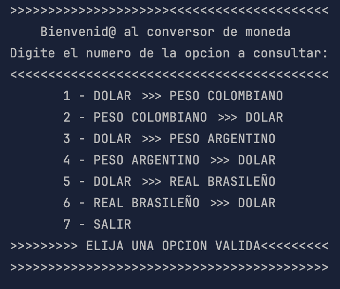
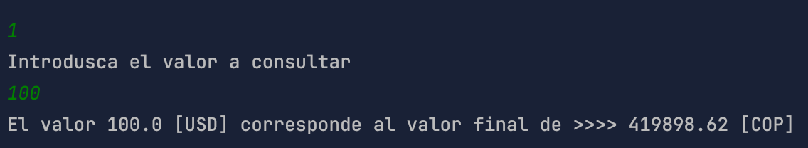
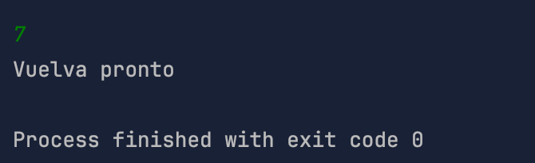

# challenge_conversorMonedas

## CONVERSOR DE MONEDAS JAVA

Creo una aplicacion para consultar de un menu preestablecido, un grupo de monedas en relacion con el dolar, para lo cual es necesario seleccionar una opcion, que va del 1 al 7, en un bucle de repeticion while, asi realizar las consultas y para teminar la ultima opcion (7), la cual finaliza el programa.

## Herramientas utilizadas
- **JAVA 21**
- **INTELLIJ IDEA**
- **BIBLIOTECA GSON**
- **EXCHANGUERATE-API**

>Aplicación Conversor de monedas.

## Conceptos utilizados

- **Declaración de variables**
- **Casting**
- **Text Block**
-  **Slice**
-  **Bucle While**
-  **Swich Case**
-  **Conditinal if Else**
-  **Encapsulacion**
-  **Manejo datos Json**
- **Class Scaner:**
- **Class HttpClient:**
- **Class HttpRequest:**
- **Interfaz HttpResponse**
-  **Try - Cash**

